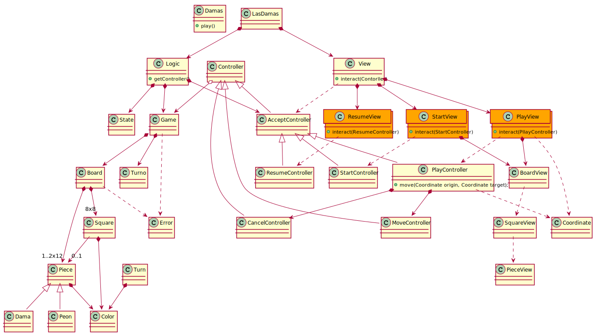

# Draughts
Project for first week of Swoftware testing. We must cover controllers and models to check that there is no known error in our software. We don't need to implement our classes, but just have a stub of them.

## Class diagram

