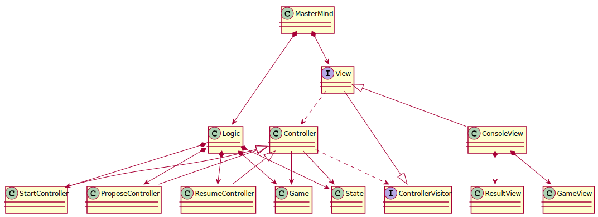

# MasterMind
Project for second week. Starting with the sample code provided, we will follow the steps in [this project Klondike](https://github.com/iraticasi/klondike). Specifically, we should:

1. From the given classes, extract both views and models, to decouple the view from our models.
2. Create a controller for each usage case.
3. Create a State object which integrates with controllers to model a states machine.
4. Finally, we will apply the Visitor pattern to be able to easily aggregate new usage cases. 

## Class diagram

