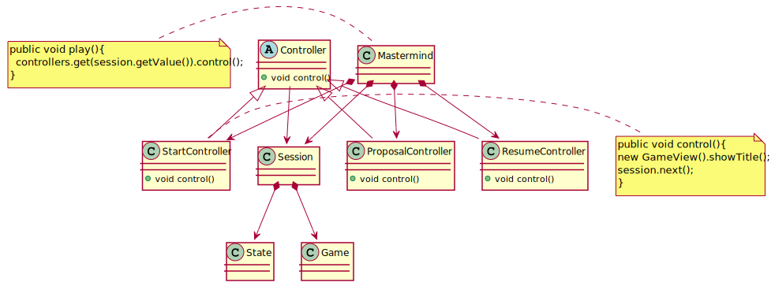

# MasterMind + MVP with passive view
Project for the fourth week. Starting with the sample code provided, we will use a different architectural pattern. Instead of MVP with model-presenter, we will use a different approach: MVP with passive view.

## Class diagram
Based on the class diagram seen during the class (see below), we should update our controllers so they take on the control logic that was still present in the views. Now, views are even smaller, making it easier for us to add test coverage for our project.

Please also note an abstract factory has been created, so that our controllers can interact with console views, but also with different technologies.
