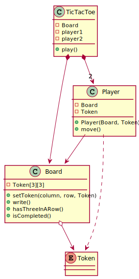

# Tic Tac Toe

Proposed user interface:
```
----- TIC TAC TOE -----
Player 1
Insert row and column: 4 1
Invalid numbers, they must be 1, 2 or 3.
Insert row and column: 1 1
*************
* X *   *   *
*************
*   *   *   *
*************
*   *   *   *
*************
Player 2
Insert row and column: 1 1
Slot in use.
Insert row and column: 1 2
*************
* X * O *   *
*************
*   *   *   *
*************
*   *   *   *
*************
Player 1
Insert row and column: 2 2
*************
* X * O *   *
*************
*   * X *   *
*************
*   *   *   *
*************
Player 2
Insert row and column: 1 3
*************
* X * O * O *
*************
*   * X *   *
*************
*   *   *   *
*************
Player 1
Insert row and column: 3 3
*************
* X * O * O *
*************
*   * X *   *
*************
*   *   * X *
*************
Player 1 wins!
```

In case of draw, the following is displayed:

```
Player 1
Insert row and column: 3 3
*************
* X * O * O *
*************
* X * X * X *
*************
* O * X * O *
*************
Draw!
```

## Class diagram

